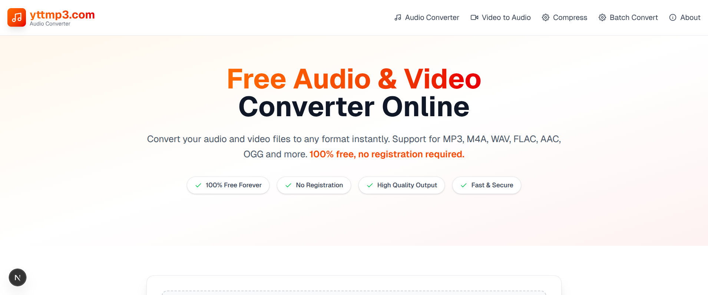
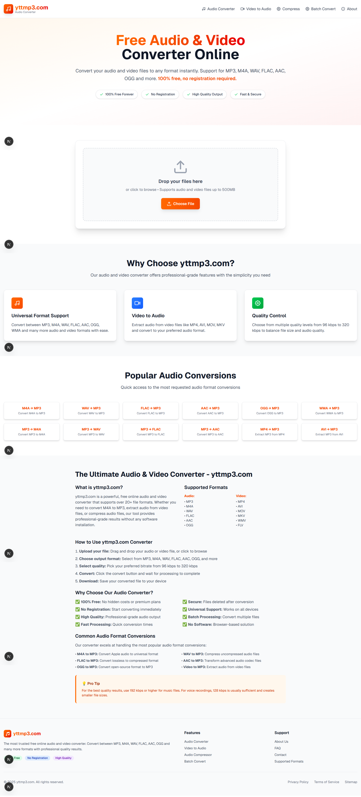
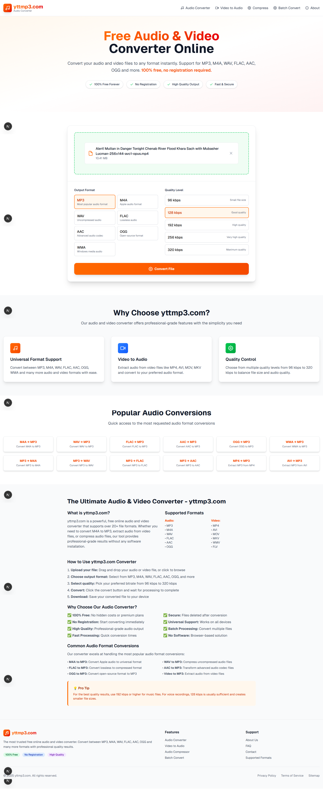

# 🎵 yttmp3.com - Free Audio & Video Converter

<div align="center">



**Convert your audio and video files to any format instantly. 100% free, no registration required.**

[](https://yttmp3.com)
[](https://github.com/Bilaltoor1/yt-mp3)
[](LICENSE)

</div>

## 📖 About

**yttmp3.com** is a powerful, free online audio and video converter that allows you to convert media files between various formats instantly. Built with modern web technologies, it offers high-quality conversions without requiring any downloads or registrations.

## ✨ Features

### � **Core Features**
- **Multiple Audio Formats**: MP3, M4A, WAV, FLAC, AAC, OGG, WMA
- **Video to Audio**: Extract audio from MP4, AVI, MOV, MKV, WebM, FLV
- **Quality Options**: 64kbps to 320kbps bitrate selection
- **Drag & Drop**: Easy file upload interface
- **Progress Tracking**: Real-time conversion progress
- **Instant Download**: Download converted files immediately

### 🚀 **Advanced Features**
- **Batch Processing**: Convert multiple files (coming soon)
- **Audio Compression**: Optimize file sizes
- **Format Detection**: Automatic input format recognition
- **Mobile Responsive**: Works perfectly on all devices
- **PWA Support**: Install as a mobile app
- **No File Limits**: Support for files up to 500MB

### 🛡️ **Security & Privacy**
- **100% Server-Side**: Secure processing on our servers
- **No Registration**: Start converting immediately
- **Secure Processing**: Files automatically deleted after conversion
- **Auto Cleanup**: Temporary files automatically removed
- **Privacy First**: Minimal tracking, maximum privacy

## 📱 Screenshots

### Main Interface

*Clean and intuitive converter interface with drag & drop support*

### Conversion Process

*Real-time progress tracking and format selection*

### Mobile Experience

*Fully responsive design that works perfectly on mobile devices*

## 🎯 Supported Formats

### 📥 **Input Formats**
**Audio:** MP3, M4A, WAV, FLAC, AAC, OGG, WMA, AIFF, AU  
**Video:** MP4, AVI, MOV, MKV, WebM, FLV, 3GP, WMV, ASF

### 📤 **Output Formats**
**Audio:** MP3, M4A, WAV, FLAC, AAC, OGG, WMA

## 🚀 Quick Start

1. **Visit**: [yttmp3.com](https://yttmp3.com)
2. **Upload**: Drag & drop your file or click to browse
3. **Select**: Choose your desired output format
4. **Convert**: Click convert and wait for processing
5. **Download**: Get your converted file instantly

## 🛠️ Local Development

### Prerequisites
- Node.js 22+
- FFmpeg
- Docker (optional)

### Installation

```bash
# Clone the repository
git clone https://github.com/Bilaltoor1/yt-mp3.git
cd yt-mp3

# Install dependencies
npm install

# Create environment file
cp .env.example .env.local

# Start development server
npm run dev
```

Visit `http://localhost:3000` to see the application.

### Production Build

```bash
# Build for production
npm run build

# Start production server
npm start
```

### Docker Deployment

```bash
# Build and run with Docker
docker-compose up -d

# Or use the automated deployment script
chmod +x deploy.sh
./deploy.sh
```

## 🏗️ Technology Stack

### **Frontend**
- Next.js 15.5.2
- React 19.1.0
- Tailwind CSS 4.1.13
- React Icons 5.5.0

### **Backend**
- Node.js
- FFmpeg
- Next.js API Routes

### **Deployment**
- Docker
- Docker Compose
- Nginx
- Let's Encrypt SSL

### **Development Tools**
- ESLint
- PostCSS
- Geist Font Family

## 📊 Performance

- ⚡ **Lightning Fast**: Optimized conversion algorithms
- 📱 **Mobile Optimized**: Responsive design for all devices  
- 🔒 **Secure**: Server-side processing ensures security
- 🌍 **Global Access**: Works from anywhere in the world
- 📈 **Scalable**: Built to handle high traffic

## 🤝 Contributing

Contributions are welcome! Please feel free to submit a Pull Request.

1. Fork the project
2. Create your feature branch (`git checkout -b feature/AmazingFeature`)
3. Commit your changes (`git commit -m 'Add some AmazingFeature'`)
4. Push to the branch (`git push origin feature/AmazingFeature`)
5. Open a Pull Request

## 📝 License

This project is licensed under the MIT License - see the [LICENSE](LICENSE) file for details.

## 👨‍💻 Author

**Muhammad Bilal**
- GitHub: [@Bilaltoor1](https://github.com/Bilaltoor1)
- Website: [yttmp3.com](https://yttmp3.com)

## 🙏 Acknowledgments

- FFmpeg team for the amazing media processing library
- Next.js team for the excellent React framework
- Tailwind CSS for the utility-first CSS framework
- All contributors and users of this project

## 📞 Support

If you have any questions or need help, feel free to:
- Open an issue on GitHub
- Visit our [website](https://yttmp3.com)
- Check out our [documentation](DEPLOYMENT_SUMMARY.md)

---

<div align="center">

**⭐ Star this repository if it helped you!**

Made with ❤️ by [Muhammad Bilal](https://github.com/Bilaltoor1)

</div>
